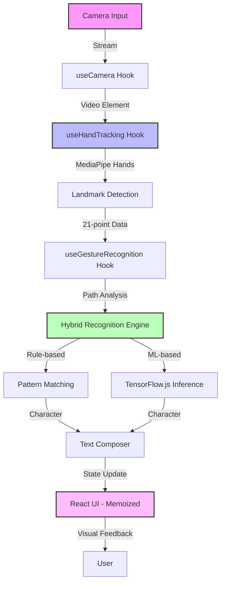

# ✨ AirScript AI

<div align="center">


</div>

> **The interface after touch.** AirScript AI converts spatial finger movement into structured text—redefining how humans communicate with machines.

---

## 🌌 North star

Keyboards assume hands, desks, and posture.
AirScript AI assumes **intent**.

This project explores a post-keyboard future where space becomes the input surface and vision becomes the sensor—enabling accessibility-first, device-agnostic text creation.

---

## 🔬 What Makes This Non‑Obvious

* **Spatial-first Input** — No surface, no wearables, no calibration ritual
* **Intent over Precision** — Designed to tolerate human imperfection
* **UI as Feedback Loop** — Visual cues actively improve user accuracy
* **Local-First AI** — Zero cloud dependency, zero data exhaust
* **ML-Ready Architecture** — TensorFlow.js integration for advanced recognition

---

## 🧠 Capability Stack

### 1. Perception Layer

* Real-time webcam ingestion via custom `useCamera` hook
* MediaPipe Hands landmark detection (21-point model)
* Temporal landmark smoothing with adaptive filtering
* Dynamic sensitivity configuration

### 2. Interpretation Layer

* Gesture segmentation via `useHandTracking` hook
* Stroke vectorization and path normalization
* Noise suppression & drift correction
* Frame-rate throttling for optimal performance

### 3. Cognition Layer

* Hybrid recognition engine:
  * Rule-based pattern matching (26 letters A-Z)
  * TensorFlow.js integration for ML-based inference
  * 28x28 tensor preprocessing pipeline
* Stroke timing heuristics with configurable timeout
* Error-tolerant recognition with confidence scoring

### 4. Expression Layer

* Live stroke visualization with gradient effects
* Text synthesis & editing (Space, Delete, Clear)
* Memoized rendering for performance optimization
* Control surface (sensitivity, timeout, smoothing)
* Real-time confidence and recognition history display

---

## 🏗️ Reference Architecture



---

## 📂 Repository Structure

```
Air_Write/
├── src/
│   ├── components/
│   │   ├── AirDrawing.tsx       # Orchestration component
│   │   ├── LetterPatterns.ts    # Pattern matching algorithms
│   │   ├── TextDisplay.tsx      # Memoized output visualization
│   │   └── Instructions.tsx     # Onboarding guides
│   ├── hooks/
│   │   ├── useCamera.ts         # Camera lifecycle management
│   │   ├── useHandTracking.ts   # MediaPipe integration
│   │   └── useGestureRecognition.ts # Drawing & ML recognition
│   ├── App.tsx                  # Main application & state management
│   └── main.tsx                 # Entry point
├── public/                      # Static assets
└── package.json                 # Dependencies and scripts
```

---

## 🧪 Engineering Highlights

* **Modular Hook Architecture** — Separated concerns for camera, tracking, and recognition
* **Frame-synced Render Loop** — Landmark-to-UI coherence at 30 FPS
* **Adaptive Smoothing** — Balances latency vs accuracy dynamically
* **React.memo Optimization** — Prevents unnecessary re-renders in TextDisplay
* **Strict TypeScript Typing** — Type safety across ML–UI boundaries
* **TensorFlow.js Ready** — Pre-processing pipeline for custom models
* **Configurable Settings** — Live sensitivity and timeout adjustments

---

## 🛠️ Technology Stack

**Frontend**

* React 18 (declarative UI with hooks)
* TypeScript (type safety across CV boundaries)
* Vite (fast dev + optimized builds)

**Styling**

* Tailwind CSS
* Glassmorphism & depth-based UI cues
* Gradient effects and animations

**Computer Vision & ML**

* MediaPipe Hands (real-time landmark inference)
* TensorFlow.js (ML model integration)
* Custom preprocessing for 28x28 tensors

**Icons**

* Lucide React

---

## ⚙️ Setup & Execution

### Prerequisites

* Node.js v16+
* npm v8+
* Webcam-enabled device
* Modern browser (Chrome/Edge recommended)

### Installation

```bash
git clone https://github.com/Ajaykannagit/Air_Write.git
cd Air_Write
npm install
```

### Development Mode

```bash
npm run dev
```

Access at `http://localhost:5173`

### Production Build

```bash
npm run build
npm run preview
```

### Code Quality

```bash
npm run lint
```

---

## 🎛️ Tunable Parameters

| Control        | Purpose                         | Default | Range      |
| -------------- | ------------------------------- | ------- | ---------- |
| Sensitivity    | Hand detection confidence       | 0.7     | 0.3 - 0.9  |
| Stroke Timeout | Character boundary detection    | 1500ms  | 1s - 2s    |
| Smoothing      | Reduces jitter in path tracking | Adaptive| Auto       |
| Frame Rate     | Processing frequency            | 30 FPS  | Fixed      |

---

## 🎯 Recent Improvements (v2.0)

### Architecture Refactor
* ✅ Decomposed monolithic `AirDrawing.tsx` into specialized hooks
* ✅ Implemented `useCamera`, `useHandTracking`, `useGestureRecognition`
* ✅ Improved code maintainability and testability

### ML Integration
* ✅ Added TensorFlow.js dependency
* ✅ Implemented 28x28 grayscale tensor preprocessing
* ✅ Ready for custom-trained character recognition models

### Performance Optimization
* ✅ Memoized `TextDisplay` component with React.memo
* ✅ Throttled timestamp updates to reduce re-renders
* ✅ Optimized frame processing loop

### UX Enhancements
* ✅ Functional settings panel (sensitivity & timeout)
* ✅ Real-time confidence scoring display
* ✅ Recognition history tracking
* ✅ Improved visual feedback with gradients

---

## ♿ Accessibility Impact

* Enables text input without physical contact
* Reduces dependency on fine motor control
* Supports inclusive computing scenarios
* No special hardware required

---

## 🔐 Privacy & Trust Model

* No video persistence
* No server communication
* Explicit camera permission lifecycle
* Fully client-side execution
* Zero telemetry or tracking

---

## ⚡ Performance Envelope

* 30 FPS on mid-range laptops
* CPU-optimized landmark filtering
* Best on Chromium-based browsers (Chrome, Edge)
* Minimal memory footprint (~50MB)

---

## 🚧 Known Constraints

* Lighting conditions affect accuracy
* Single-hand interaction only
* Alphabet-focused recognition (A-Z)
* Requires stable camera positioning

---

## 🧭 Forward Trajectory

### 1. Core Recognition & Intelligence
* **✨ Cursive & Continuous Writing** — Segmenting single long strokes into individual characters using sequence modeling (LSTMs/Transformers).
* **✨ Multi-Hand & 3D Gestures** — Evolving beyond single-hand 2D planes to 3D object manipulation and two-handed command sets.
* **✨ Personalized Adaptation** — Systems that learn user-specific shorthands and adapt to unique handwriting styles ("font" recognition).

### 2. UI/UX & Multimodal Interaction
* **✨ AR Integration** — Bringing "Air Write" to life by floating text in real-world environments via headsets or mobile AR.
* **✨ Haptic Feedback** — Integrating wearable haptics to provide a tactile sense of the virtual writing surface.
* **✨ Voice & Gesture Fusion** — Combining vocal commands with spatial writing for a seamless multi-modal experience.
* **✨ Generative AI Styling** — Using LLMs and image models to render air-written words with dynamic visual styles (e.g., "Fire" rendered in flames).

### 3. Ecosystem & Integrations
* **✨ OS-Level Control** — Extending gestures to system-wide navigation, application switching, and desktop control.
* **✨ Collaborative Spaces** — Shared virtual canvases where multiple users can write and draw together in real-time.
* **✨ Accessibility Devices** — Refining the engine into a powerful silent communication tool for individuals with speech impairments.
* **✨ Platform Expansion** — Packaging as PWA and Electron-based desktop apps for better resource access and native feel.

---

## 🧠 Research Alignment

* Human–Computer Interaction (HCI)
* Vision-based input systems
* Accessibility engineering
* Post-touch interaction models
* On-device machine learning

---

## 🤝 Contribution Philosophy

This project welcomes:

* CV researchers
* HCI designers
* Accessibility advocates
* System optimizers
* ML engineers

Fork boldly. Challenge assumptions. Submit PRs.

---

## 📄 License

MIT License — unrestricted experimentation encouraged.

---

## 🌟 Attribution

Built on open research, powered by community curiosity.

Special thanks to:
* MediaPipe team for hand tracking
* TensorFlow.js community
* React and Vite maintainers

---

**AirScript AI**
*When space becomes language.*
